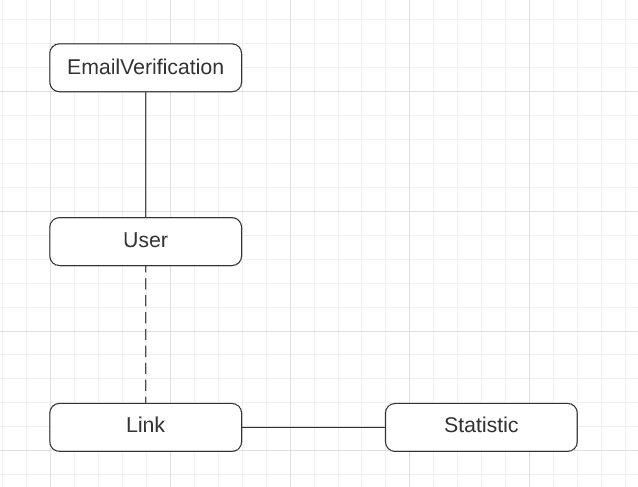
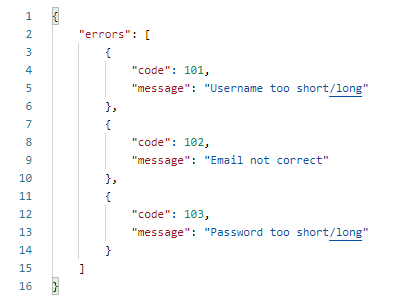

[![Stargazers][stars-shield]][stars-url]
[![MIT License][license-shield]][license-url]
[![LinkedIn][linkedin-shield]][linkedin-url]

<br />
<p align="center">
  <a href="https://github.com/JKusio/ShortLink">
    
  </a>

  <h3 align="center">Short Link</h3>

  <p align="center">
    My small project to makes links short! :globe_with_meridians:
    <br />
    Making this project was a great opportunity to learn and test some new things! :fire:
    <br />
    <br />
    Demo avialable soon! (Need to do frontend)
    ·
    <a href="https://github.com/JKusio/ShortLink/issues">Report Bug</a>
    ·
    <a href="https://github.com/JKusio/ShortLink/issues">Request Feature</a>
  </p>
</p>

<details open="open">
  <summary>Table of Contents</summary>
  <ol>
    <li>
      <a href="#about-the-project">About The Project</a>
      <ul>
        <li><a href="#built-with">Built With</a></li>
      </ul>
    </li>
    <li>
      <a href="#getting-started">Getting Started</a>
      <ul>
        <li><a href="#instalation">Instalation</a></li>
        <li><a href="#configuring-env-file">Configuring .env file</a></li>
        <li><a href="#nodejs">Node.js</a></li>
        <li><a href="#mongodb-setup">MongoDB setup</a></li>
        <li><a href="#email-setup">Email setup</a></li>
      </ul>
    </li>
    <li>
      <a href="#backend">Backend</a>
      <ul>
        <li><a href="#basic-informations">Basic informations</a></li>
        <li><a href="#basic-informations">API</a></li>
      </ul>
    </li>    
    <li><a href="#wip">WIP</a></li>
    <li><a href="#contributing">Contributing</a></li>
    <li><a href="#license">License</a></li>
    <li><a href="#contact">Contact</a></li>
    <li><a href="#acknowledgements">Acknowledgements</a></li>
  </ol>
</details>

## About The Project
One of the most important things for everyone is to constantly keep on learning new things. That's why I've decided to create this project, since there weren't any MEVN (or MEN for now since Vue.js frontend will be added later) stack projects on my GitHub page. This project is quite simple. You give your very long URL to the API and it returns a shortened version you can use! I've also added users and admins that can perform more actions! I've also added statistics for each link which monitors how many times each link was clicked and from what region!

This project was a great opportunity to learn Node itself! It gave me a better understanding of using modules and using different design patterns in it. </br>
I've also used express as my web application framework. It is a great tool and I'm glad I could be using it, not only reading about it! </br>
I've selected MongoDB as my database, and used mongoose ORM. It really simplified a lot of things! </br>

### Built With

* [Node.js](https://nodejs.org) - 
* [Express](https://expressjs.com/)
* [MongoDB](https://www.mongodb.com/)
* [Vue.js](https://vuejs.org/) - Will be added soon for frontend


## Getting Started

To get a local copy up and running follow these simple steps! </br>

### Installation

1. Clone the repo
   ```sh
   git clone https://github.com/your_username_/Project-Name.git
   ```
2. Install NPM packages
   ```sh
   npm install
   ```
3. Configure .env file


### Configuring .env file
For now only the backend is avialable! </br>
In backend directory you'll find .env.example. Create a copy of, it in the same directory, named .env </br>
**It is crucial for the app to load correctly.** It contains the most important options for the application! 

### Node.js
Since my code uses some newer js (like optional chaining), you'll need to use Node.js version at least 14.*

### MongoDB setup
I've used MongoDB Docker image.
</br> 
[MongoDB Image](https://hub.docker.com/_/mongo)
</br>
If you have your MongoDB up and running you'll need to change **MONGODB_URI** in .env file.
```
MONGODB_URI='mongodb://localhost'
```

### Email setup
I've used free and fake ethereal mails for developement. </br>
It doesn't send any mails, but you'll be able to check what would be sent on their site. </br>
[Ethereal Mail](https://ethereal.email/) </br>
You'll need to change those parameters in .env file
```
EMAIL_ADDRESS=jankowalski@ethereal.email
EMAIL_PASSWORD=12345678
SMTP_ADDRESS=smtp.ethereal.email
SMTP_PORT=587
```

## Backend
The backend is running on node with express.js and mongoDB. </br>
You can import the postman collection to your instansce of Postman. </br>
You will find collection with all requests in backend **directory**.

### Basic informations
This application is simple, and so is it's structure.

</br>
Using the API you can register new users. On register event is emitted and verification email is sent to the user! You can also perform basic oprations like logging in, logging out, chaning password and email address. </br>
Admins can also get list of all users, by id or delete them.

Links can be created even by anyone! Even by unregistred user!
</br>
When user is logged in, the link will be assign to the account.
In request you can set custom code or generate one by id. The short link generator works the same as in the cutt.ly website. I've could use **n random characters generator** but that wouldn't be as efficient as just generating a **n characters long unique code** based on id. Each time new short link is generated **id is increased by one**.

When someone visits the short link an event is emitted and statistics are stored in the databse. The statistic schema contains **access time**, **referer** (from header) and **language** (from header).

### API
I've created many endpoints, but there are still some in developement! </br>
</br>

**Error handling** </br>
Even though we try to make our software have no errors at all, sometimes we'll run into them. Either because we made some errors in writing our app, users passing wrong data to the request or because the system just crashes. To make the life easier for me (and other developers) I've followed some rules of making RESTful API and added some error codes that will tell us if something went wrong.

Example response when we send wrong data during registration!
</br>



<strong>[100 codes] - Register codes</strong>
</br>
[101] - Username not correct! It needs to be between 5 and 16 characters and contain only standard alphabet characters, numbers and . - _
</br>
[102] - Email not correct
</br>
[103] - Password not correct! It needs to be between 8 and 24 characters. It needs to contain at least 1 number and 1 special character!
</br>
[104] - Username already taken
</br>
[105] - Email already taken
</br>
[106] - Wrong verification token
</br>
</br>
<strong>[200 codes] - Login codes </strong>
</br>
[201] - Wrong name/password combination
</br>
[202] - Account not verified
</br>
[203] - Not authenticated
</br>
[204] - No admin access
</br>
</br>
<strong>[300 codes] - Link codes </strong>
</br>
[301] - Wrong URL
</br>
[302] - Custom URL taken
</br>
[303] - Custom URL has forbidden characters
</br>
[304] - Wrong expiration date format
</br>
[305] - Expiration date passed
</br>
[306] - Link does not exists
</br>
</br>
<strong>[400 codes] - Server codes </strong>
</br>
[401] - No MongoDB connection
</br>
[402] - No LinksCounter found
</br>
</br>
<strong>[500 codes] - User codes </strong>
</br>
[501] - User does not exists
</br>
</br>
<strong>[600 codes] - Other codes </strong>
</br>
[601] - No URL found
</br>

## WIP
* More link and statistic endpoints (CRUD operations)
* Query filters
* Query sorting
* Pagination
* Sending email with critical errors to admin
* Tests

## Contributing

Contributions are what make the open source community such an amazing place to be learn, inspire, and create. Any contributions you make are **greatly appreciated**.

1. Fork the Project
2. Create your Feature Branch (`git checkout -b feature/AmazingFeature`)
3. Commit your Changes (`git commit -m 'Add some AmazingFeature'`)
4. Push to the Branch (`git push origin feature/AmazingFeature`)
5. Open a Pull Request

<!-- LICENSE -->
## License

Distributed under the MIT License. See `LICENSE` for more information.

## Contact

Jakub Kusiowski - [@JakubKusiowski](https://twitter.com/JakubKusiowski) - jakubkusiowski@gmail.com

Project Link: [https://github.com/JKusio/ShortLink](https://github.com/JKusio/ShortLink)

## Acknowledgements
* [Docker](https://www.docker.com/)
* [Passport.js](http://www.passportjs.org/)
* [Mongoose](https://mongoosejs.com/)
* [Ethereal Mail](https://ethereal.email/)
* [Nodemailer](https://nodemailer.com/about/)
* [Img Shields](https://shields.io)

[stars-shield]: https://img.shields.io/github/stars/JKusio/ShortLink.svg?style=for-the-badge
[stars-url]: https://github.com/JKusio/ShortLink/stargazers
[license-shield]: https://img.shields.io/badge/LICENSE-MIT-blue?style=for-the-badge
[license-url]: https://github.com/JKusio/ShortLink/blob/main/LICENSE
[linkedin-shield]: https://img.shields.io/badge/-LinkedIn-black.svg?style=for-the-badge&logo=linkedin&colorB=555
[linkedin-url]: https://www.linkedin.com/in/jakub-kusiowski/
[product-screenshot]: images/screenshot.png